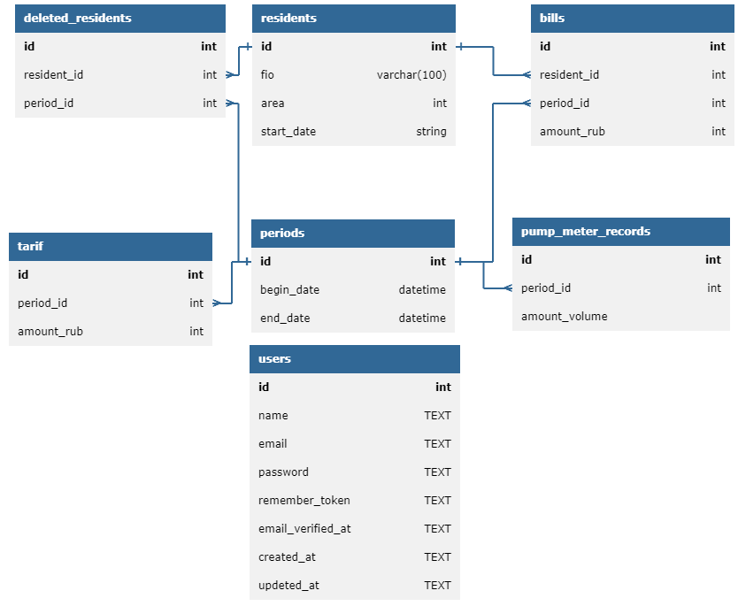

<p align="center"><a href="https://laravel.com" target="_blank"></a></p>

<p align="center">
<a href="https://github.com/laravel/framework/actions"></a>
<a href="https://packagist.org/packages/laravel/framework"></a>
<a href="https://packagist.org/packages/laravel/framework"></a>
<a href="https://packagist.org/packages/laravel/framework"></a>
</p>

<h1 align="center">Это API для проекта <a href="https://github.com/Mark65537/pumphouse-frontend">Водокачка+</a></h1>

# Инструкция по запуску
Для начала у вас должен быть установлен <a href="https://www.php.net/downloads.php">php</a> и <a href="https://getcomposer.org/download/">composer</a>
</p>
После этого можете запустить локальный сервер используйя файл "ZZ) RUN.bat" в корне проекта или команду

```bash
php artisan serve
```
После выполнения команды запуститься локальный сервер по адресу 
http://localhost:8000 

Порт может отличаться взависимости от машины
# Инструкция по использованию API
Для удобства в файле postman_API_test_collection.json 
содержаться примеры использования всех API в 
<a href="https://www.php.net/downloads.php">Postman</a> 

Список всех возможных API:

### Residents
`GET http://localhost:8000/api/residents`</br>
`POST http://localhost:8000/api/residents`</br>
`PUT http://localhost:8000/api/residents/id`</br>
`DELETE http://localhost:8000/api/residents`</br>
### Tarif
`GET http://localhost:8000/api/tarifs`</br>
`POST http://localhost:8000/api/residents`</br>
### Period
`POST http://localhost:8000/api/periods`</br>
### Bill
`GET http://localhost:8000/api/bills`</br>
`POST http://localhost:8000/api/bills`</br>
### Auth
`POST http://localhost:8000/api/login`</br>

### Заголовок для запросов

| Header | Value |
| ------ | ----- |
| Content-Type | application/json |

### Пример Тела запроса

Тело запроса должно включать объект JSON со следующими свойствами:

```json
{
    "name": "your_username",
    "password": "your_password"
}
```
### Пример успешного ответа на запрос

Код: 200 OK

Контент:
```json
{
    "user": "your_username",
    "token": "your_auth_token"
}
```

### Пример отправки запроса

Пример как залогиниться используя curl:

```bat
curl -X POST -H "Content-Type: application/json" \
-d '{"name": "your_username", "password": "your_password"}' \
http://localhost:8000/api/login
```
# База Данных
В качестве базы данных используется SQLite

Файл базы данных database.sqlite.

Структура базы данных:


В проекте содержаться файлы миграций. 

Структура базы данных созданна с помощью <a href="https://databasediagram.com/app">Database diagram</a> содержиться
в файле database_diagram.dbd

Если возникают сложности при создании базы данных 
в папке SQL scripts содержаться необходимые скрипты
для создания и изменения отдельных таблиц

